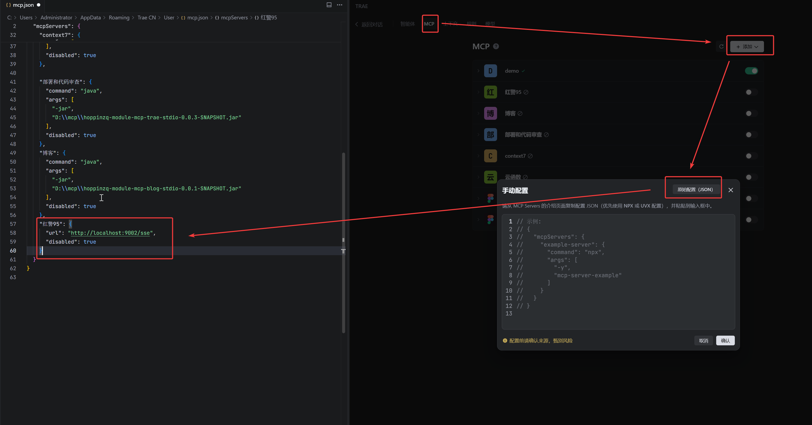

# hoppinai-mcp-red95
让你用对话的方式玩红警
# 环境
git、dotnet6.0、JDK17+

# 开始
### 代码拉取
- 1、从git上拉取红警源代码：
https://gitee.com/hoppin/OpenRA.git
- 2、切换到code_gen_test分支

### 游戏构建
根据源代码构建即可，windows示例：(在OpenRA文件夹内执行指令)
```text
dotnet restore --source https://nuget.cdn.azure.cn/v3/index.json
dotnet build
```
C#运行环境dotnet建议可以安装Visual Studio的C#相关内容
### 运行
执行指令即可运行游戏
```text
.\launch-game.cmd Game.Mod=copilot
```
或者在我们的源代码的CmdTools文件夹内将OPENRA_PATH替换为OpenRA文件夹的绝对路径：
```java
@Service
public class CmdTools {
    private static final String OPENRA_PATH="D:\\myProject\\github\\OpenRA";

    @Tool(name = "start_game",description = "开启游戏，仅当用户要求开启游戏时，才会使用该工具，注意：开启完游戏后，不要执行任何工具！！！")
    public String startGame(){
        try {
            String cmd = "cmd /c cd "+OPENRA_PATH +"&& .\\launch-game.cmd Game.Mod=copilot";
            Runtime runtime = Runtime.getRuntime();
            runtime.exec(cmd);
        } catch (Exception e) {
            e.printStackTrace();
        }
        return "ok";
    }
}
```
启动mcpServer，也就是这个工程，会打印端口号

### mcp配置
在任意智能体内，设置mcp


然后开始对话就行了。  
可以添加示例提示词：
```text
你是 OpenRA 实时指令助手。你只需要执行游戏动作。
### 你每次都要用提供的工具工作，不要自作主张
### 你每次都先get_game_state来刷新状态，获取可以操作的actor_id。
### 你只能调用工具并传入真实的 actor_id（整数），不能传入像 "MCV"、"actor_1" 这种字符串。
### 如果你不知道 actor 的 ID，请先调用 get_game_state 获取玩家所有信息，得到目标的actor_id。
### 你每次调用工具后，系统会返回其执行结果。你必须根据该结果判断是否已完成任务：
    - 如果结果满足目标，不要再重复调用工具。
    - 如果还未完成，再决定是否调用下一个工具。
    - 绝不能连续重复调用同一个工具。

```

演示见视频
